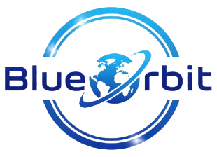

<div align="center">
  
  
  **NASA Space Apps Challenge 2025 Global Nominee** 🚀  
  <br>
  <a href="https://www.spaceappschallenge.org/2025/find-a-team/cosmic-horizons/">
    
  </a>
  <br>
  [Check out our Cosmic Horizons Team Page!](https://www.spaceappschallenge.org/2025/find-a-team/cosmic-horizons/)
</div>

---

## 🌌 Overview
**Blue Orbit** is an immersive, interactive web application built to take users on a journey through space and cosmic horizons. Combining cutting-edge web 3D technologies, interactive storytelling, and AI-powered assistance, we aim to make learning about space an engaging and unforgettable experience.

## 🛠️ How We Built It (Our Tech Stack)
We wanted to build something that felt alive and deeply interactive. Here is the magic behind the scenes:

* **React & React Router**: The core framework driving our multi-part journey (`Part 1` through `Part 6`). It ensures smooth, single-page transitions without reloading the page.
* **Three.js & React-Globe.gl**: We used powerful WebGL libraries to render stunning, interactive 3D globes and planetary environments directly in the browser.
* **Spline 3D (`@splinetool/react-spline`)**: Used for embedding beautiful, real-time 3D models and animations into our UI effortlessly.
* **Gemini AI Integration**: We built a custom `AIChat` component powered by Google's Gemini API, allowing users to ask natural language questions and get intelligent, space-related answers dynamically.
* **Immersive Audio**: We utilized HTML5 Audio Contexts to map background music and dynamic sound effects (like thunder and water droplets) to different scenes for a truly cinematic feel.
* **Lucide React**: For sleek, modern UI iconography.

## 🚀 Getting Started

Running this project locally is super simple. 

### 1. Install Dependencies
Open your terminal in the project folder and run:
```bash
npm install
```

### 2. Set Up Your Environment
We keep our API keys secure! Create a `.env` file in the root directory (you can copy the provided `.env.example`) and add your Gemini API key:
```env
REACT_APP_GEMINI_API_KEY=your_actual_api_key_here
```

### 3. Start the App
Run the following command to spin up the development server:
```bash
npm start
```
The app will automatically pop open in your default browser at `http://localhost:3000`.

---
*Created with ❤️ by the Cosmic Horizons Team.*
